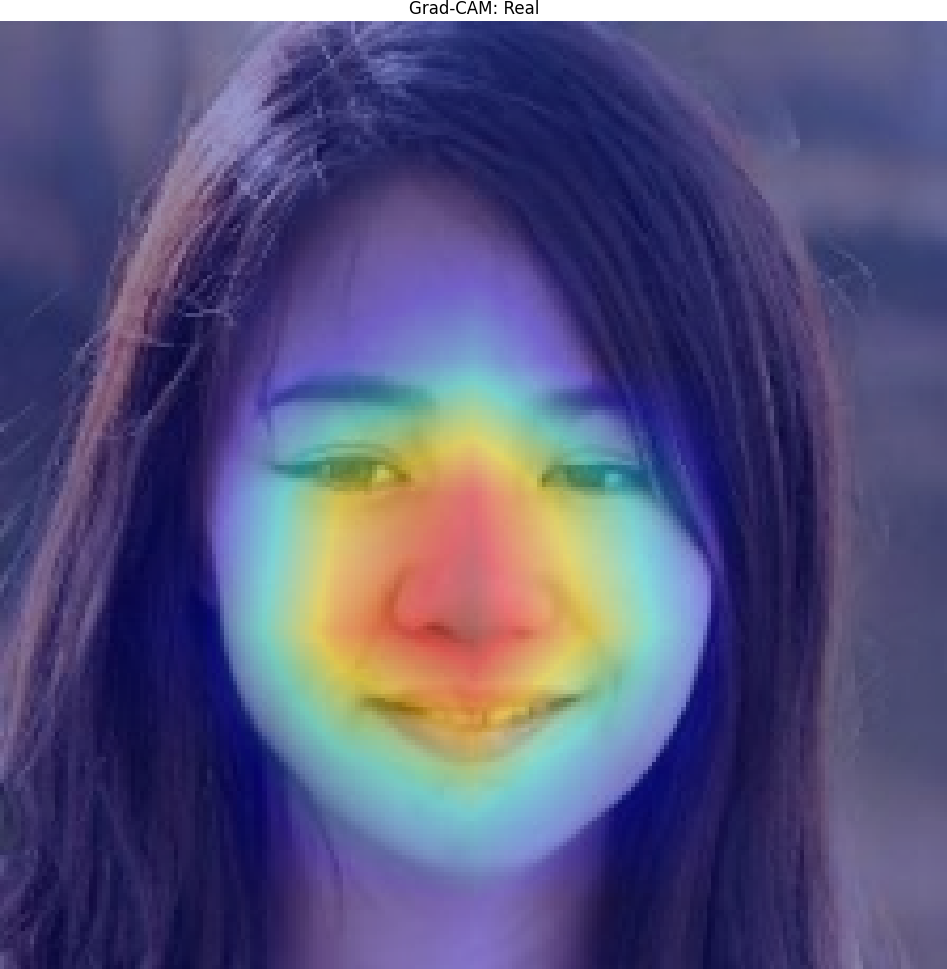
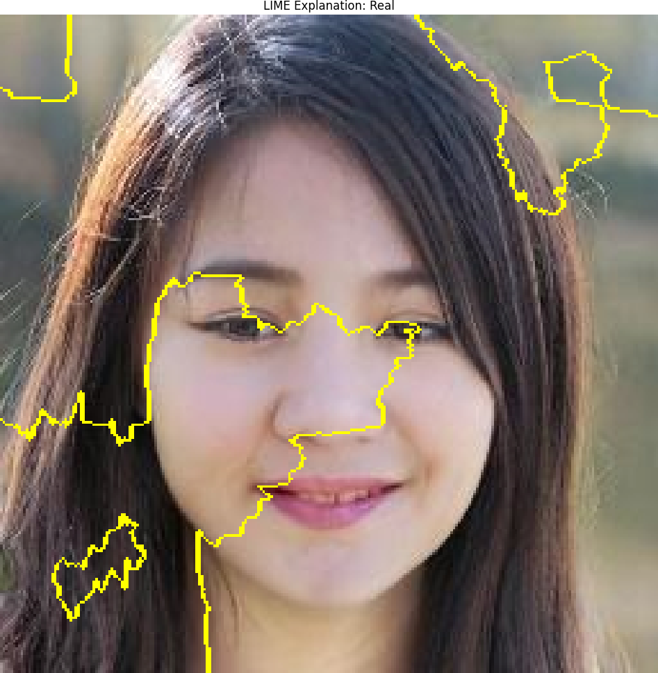
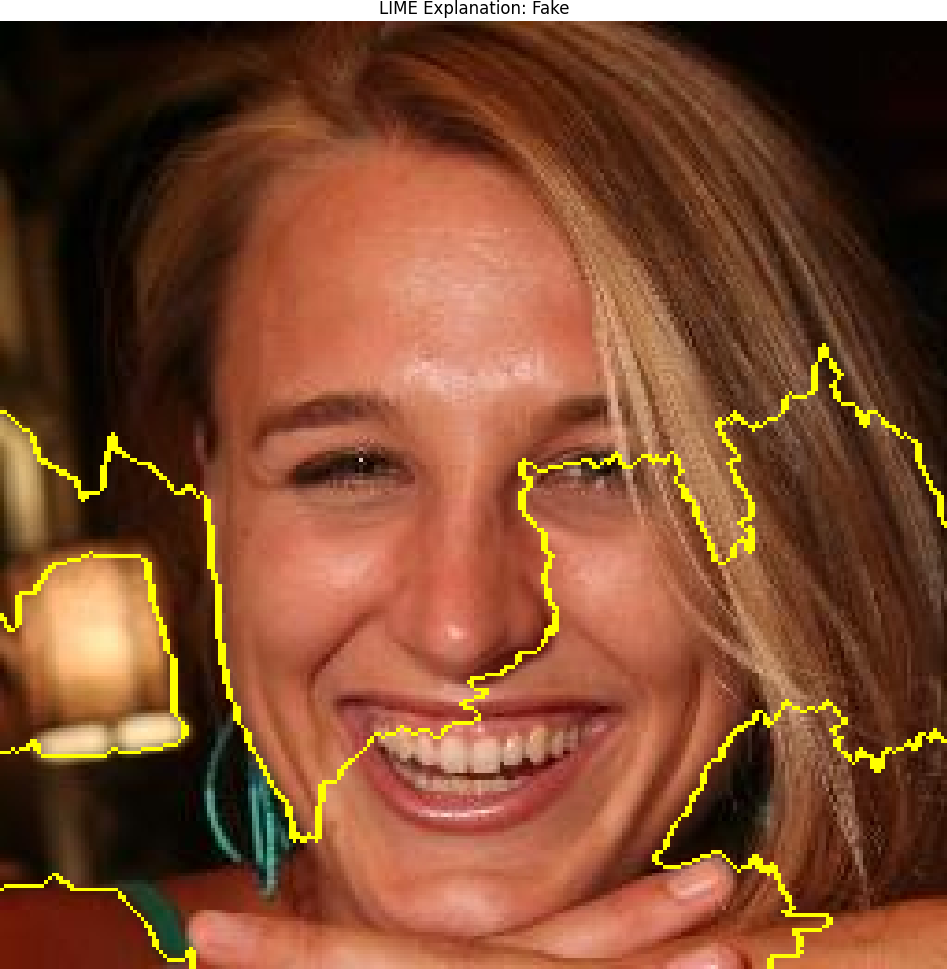
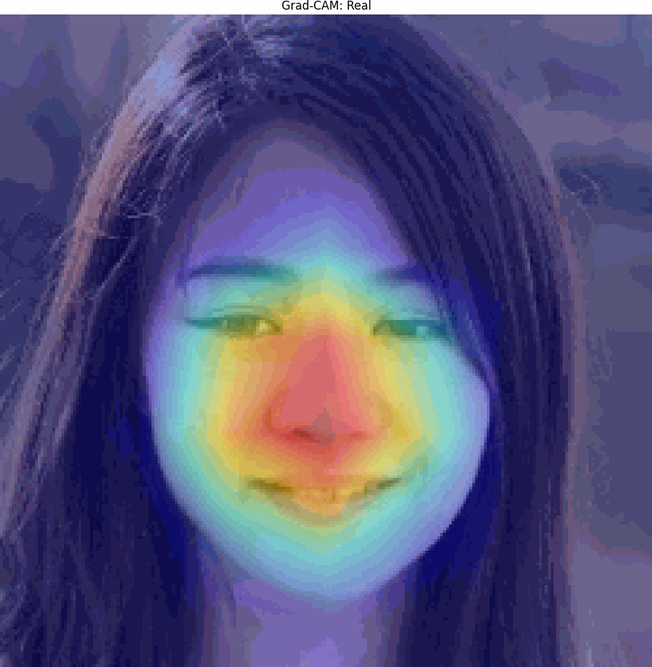

# VisAIble: Explainable Deepfake Detection with EfficientNet-B0, Grad-CAM & LIME


[](https://colab.research.google.com/github/Av1352/VisAIble/blob/main/notebooks/code.ipynb)

> 🧠 *Built an explainable deepfake detector using EfficientNet-B0, Grad-CAM, and LIME — visualizing what the model “sees” when distinguishing real vs. fake faces.*

**Detect and interpret AI-generated images using fine-tuned EfficientNet-B0 with full XAI workflow. Transparent trust-building for real vs fake image classification.**

---

## 🔑 Highlights & Demo

<div align="center">

| Real Example | Fake Example |
|:-------------:|:-------------:|
|  |  |
|  |  |
|  |  |

**Full pipeline demo:**  


</div>

*Test accuracy:* See results in [notebooks/code.ipynb](notebooks/code.ipynb), typically >95% on Kaggle validation split.

---

## 🥇 TL;DR Results

| Metric         | Value                    | Visual Example                    |
|----------------|--------------------------|-----------------------------------|
| Model          | EfficientNet-B0 (timm)   |  |
| Test Accuracy  | **97.75%**               |     |
| Dataset Size   | 140k images (2GB total)  |                                   |
| XAI Methods    | Grad-CAM, LIME           |                                   |

---

## 🚀 Why This Matters

Deepfakes are eroding digital trust. **VisAIble** provides explainable detection using state-of-the-art XAI techniques, showing *why* a prediction was made.  
This approach supports **AI accountability** and is relevant for industries like **media forensics, cybersecurity, and content verification**.

---

## 🛠️ How to Run

> 💻 **Quick Start:** Open [VisAIble on Colab](https://colab.research.google.com/github/Av1352/VisAIble/blob/main/notebooks/code.ipynb) — no setup needed.

1. **Install dependencies:**  
```bash
pip install torch torchvision timm shap lime opencv-python matplotlib
```

2. **Download datasets:**  
- [Kaggle: Real and Fake Faces](https://www.kaggle.com/datasets/xhlulu/140k-real-and-fake-faces) — 140,000 images
- [Generated Pairs Archive](https://northeastern-my.sharepoint.com/:u:/r/personal/mahadevarao_s_northeastern_edu/Documents/generated_pairs_full_archive.zip?csf=1&web=1&e=5frkzF) — 2GB
- [Ground Truth Data](https://drive.google.com/drive/folders/1Dlh392g0tmBnJ64JEHcLC_XJNSMSdMxP?usp=drive_link) — 100MB

3. **Training & Finetuning:**  
- See [notebooks/code.ipynb](notebooks/code.ipynb) for basic training and 
- See [notebooks/code_finetune.ipynb](notebooks/code_finetune.ipynb) for advanced options (early stopping, scheduler).

4. **Generate explanations:**  
```bash
python generate_explanations.py
```
Output: `explanations/gradcam_*.png`, `explanations/lime_*.png`, used in demo.

5. **Create GIF for portfolio/README:**  
Output: `assets/demo.gif`

---

## 📂 Project Structure

```bash
VisAIble/
├─ assets/ # GIFs, demo screenshots
├─ explanations/ # Grad-CAM, LIME outputs
├─ models/ # .pth checkpoints
├─ notebooks/ # Training, finetuning & XAI
├─ generate_explanations.py
├─ demo.py # GIF builder
├─ run.py
├─ requirements.txt
├─ sample_real.jpg
├─ sample_fake.jpg
└─ README.md
```

---

## 🔬 Features

- **EfficientNet-B0** via timm: lightweight, scalable CNN with binary output
- **Grad-CAM:** Highlights regions influencing classification (attention heatmaps)
- **LIME:** Local perturbation-based region explanations
- **Transfer Learning:** Adapts model to custom real/fake faces
- **Modular assets:** Ready-to-use demos, visuals, and data splits

---

## 📊 Results Summary

- *Validation accuracy*: 97.75%
- *Generalization*: Strong on out-of-distribution faces, see demo results
- *XAI*: Attention regions coincide with facial centers, supporting trust in predictions

---

## 📝 Documentation & Tips

- Each file, function, and class includes explanatory comments and docstrings.
- Notebooks are organized (see `notebooks/`), show training and explainability inline.
- All README and notebook prose has been spellchecked, bulleted lists expanded.

---
📦 **Version:** v1.0 (Stable Release)  
👩‍💻 **Author:** Anju Vilashni Nandhakumar  
📬 **Contact:** [LinkedIn](https://www.linkedin.com/in/your-link/) | [Portfolio](https://vxanju.com/)
